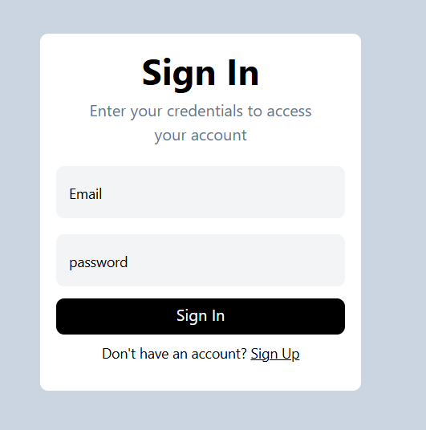

# Payments App

Welcome to my project! This project aims to replicate the basic functionality of any payments app, allowing users to perform transactions, view their account balance, and interact with other users.

## Features

* User Authentication & Authorization using JWT
* View your Account Balance
* Search and send money to other users
* Interactive UI 

## Technology Stack

* **Node.js**, **Express.js** for Backend
* **React.js**, **Tailwind Css** for Frontend
* **MongoDB** for Database

## Some screenshots from the project

* Signup Page
> 

* Signin Page

> 
* Dashboard Page

>  

## Database Transactions

This project implements MongoDB Transactions to ensure data consistency and reliability. Transactions follow the ACID properties of databases, ensuring that transactions are either fully completed and committed or reverted back in case of issues, thus preventing inconsistencies in the database.
